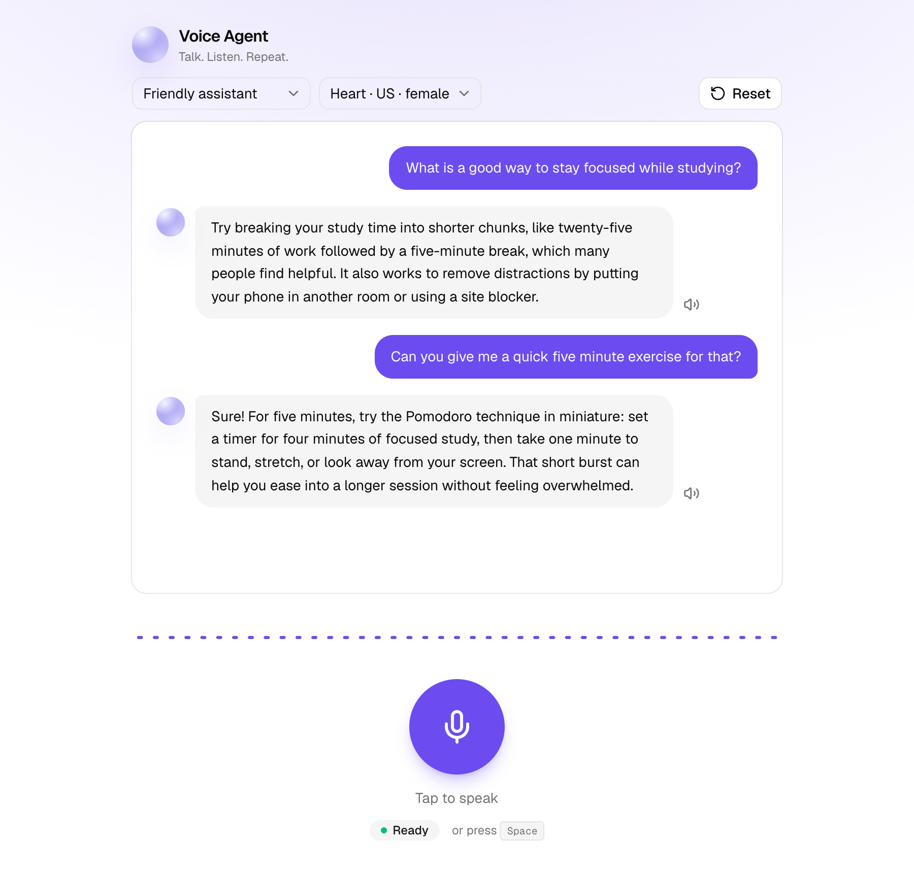
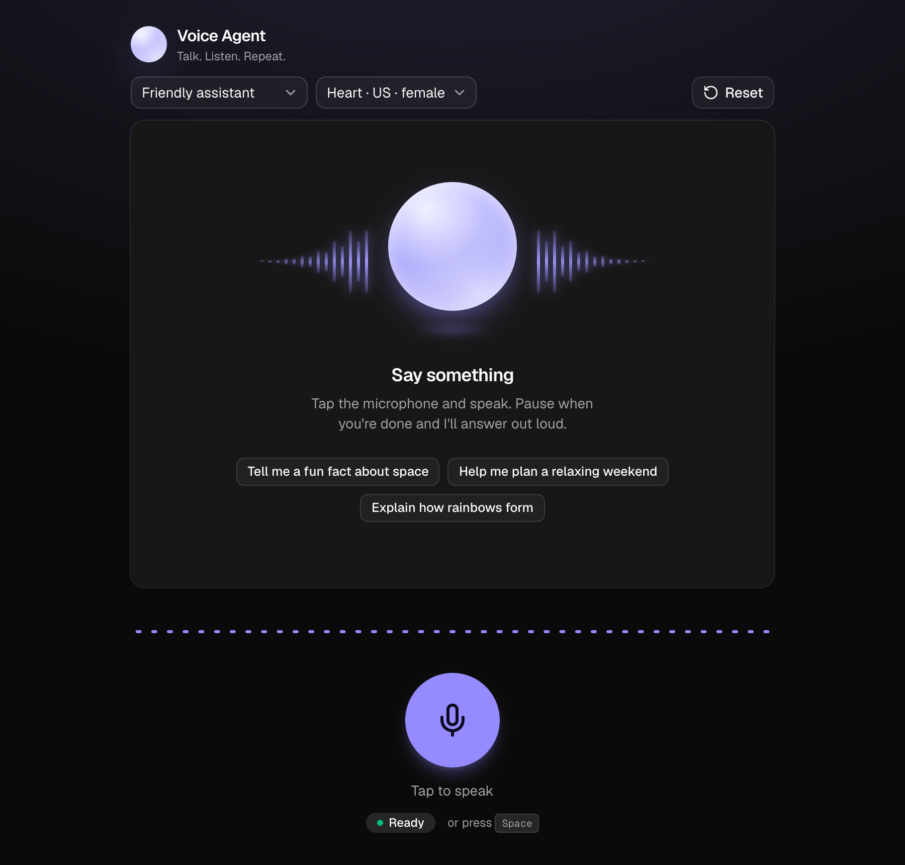

# Voice Agent

Talk to an AI and hear it answer back. Tap the microphone, speak, pause — your words are transcribed,
the reply streams into the transcript token by token, and it is read aloud in the voice and persona
you picked. Conversations persist across reloads and restarts.

Built as a take-home: a **Next.js 16** frontend, a separate **NestJS 12** API, the **Vercel AI SDK on
both sides**, and **OpenRouter** for every model (chat, speech-to-text, text-to-speech) behind one key.

| Conversation | Dark mode, empty state |
|---|---|
|  |  |

## Features

**The brief**
- Microphone button (MediaRecorder) · live transcript of both sides · reset button · responsive Tailwind UI
- `POST /api/transcribe`, `POST /api/respond`, `POST /api/speak` — plus history endpoints
- Conversation history that survives a page reload *and* a backend restart (SQLite)
- Noise control — three layers, see [below](#noise-handling-three-layers)

**Extras**
- **Live waveform** while recording, driven by a Web Audio analyser
- **Hands-free mode:** the recording ends on its own after ~1.5 s of silence (voice-activity detection)
- **Barge-in:** tap the mic while the AI is speaking and it stops and starts listening
- **Replay:** every AI message has a speaker button; generated audio is cached, so replay is instant and free
- **Voice and persona pickers** (8 voices, 4 personas) that visibly change the next reply
- Streaming replies, `Space` as a keyboard shortcut, system dark mode, graceful error states

## Architecture

```
┌──────────────────────┐   multipart audio      ┌────────────────────────┐        ┌──────────────┐
│  Browser             │ ─────────────────────► │  NestJS API  :3001     │ ─────► │  OpenRouter  │
│  Next.js 16 (React19)│   POST /api/transcribe │                        │  STT   │              │
│                      │                        │  VoiceController       │        │  whisper-    │
│  MediaRecorder       │   { conversationId,    │    ├─ AiService ───────┼──────► │  large-v3-   │
│  Web Audio (VAD)     │     message, persona } │    │   (only code that │  chat  │  turbo       │
│  useChat (AI SDK)    │ ─────────────────────► │    │    talks to the   │ ◄───── │  deepseek-   │
│                      │   POST /api/respond    │    │    provider)      │ stream │  v4-flash    │
│  <audio> playback    │ ◄───── UI-message ──── │    │                   │        │  kokoro-82m  │
│                      │        stream (SSE)    │    └─ ConversationSvc  │  TTS   │              │
│                      │   POST /api/speak      │          │             │ ─────► └──────────────┘
│                      │ ◄───── audio/mpeg ──── │          ▼             │
└──────────────────────┘                        │   SQLite (TypeORM)     │
                                                └────────────────────────┘
```

One voice turn: **record → `/transcribe` → `/respond` (streamed into `useChat`, saved to SQLite on
finish) → `/speak` → autoplay.**

## Prerequisites

- [Bun](https://bun.sh) (installs and runs scripts for both apps)
- Node.js 20+ (the Nest process itself runs on Node)
- An [OpenRouter API key](https://openrouter.ai/keys) with a little credit — a full voice turn costs a
  fraction of a cent
- A browser with microphone support (developed and tested in Chrome)

## Run it locally

Two terminals, two plain commands — no root script.

**1. Backend** (http://localhost:3001)

```bash
cd backend
bun install
cp .env.example .env        # then put your OPENROUTER_API_KEY in .env
bun run start:dev
```

**2. Frontend** (http://localhost:3000)

```bash
cd frontend
bun install
cp .env.example .env.local         # NEXT_PUBLIC_API_URL=http://localhost:3001
bun run dev
```

Open http://localhost:3000, allow the microphone, tap the orb button and talk.

### Configuration

`backend/.env`

| Variable | Default | |
|---|---|---|
| `OPENROUTER_API_KEY` | — | **Required** |
| `PORT` | `3001` | API port |
| `OPENROUTER_CHAT_MODEL` | `deepseek/deepseek-v4-flash` | Reply model |
| `OPENROUTER_STT_MODEL` | `openai/whisper-large-v3-turbo` | Speech-to-text |
| `OPENROUTER_TTS_MODEL` | `hexgrad/kokoro-82m` | Text-to-speech |

`frontend/.env.local`: `NEXT_PUBLIC_API_URL` (default `http://localhost:3001`).

> TTS voices are specific to the TTS model. The picker lists Kokoro's voices; if you change
> `OPENROUTER_TTS_MODEL`, update `AiService.VOICES` (backend) and `VOICES` in
> `frontend/lib/constants.ts` to that model's voices.

## API

All routes are under `/api`. Request bodies are validated with `class-validator`.

| Method & path | Body | Response |
|---|---|---|
| `POST /api/transcribe` | multipart, field `audio` (audio/*, ≤ 10 MB) | `{ "text": "…" }` |
| `POST /api/respond` | `{ conversationId, message, persona? }` | Streamed AI SDK UI-message events (SSE); the user message is saved first, the assistant message when the stream finishes |
| `POST /api/speak` | `{ text, voice? }` | `audio/mpeg` bytes |
| `GET /api/conversation/:id` | — | Stored messages, oldest first |
| `DELETE /api/conversation/:id` | — | `204` — clears that conversation only |

Errors come back as `{ statusCode, message }` with a human-readable `message` (bad key, no credits,
rate limit, empty recording…), which the UI shows in its error banner.

## Design decisions

**A separate NestJS API, not Next route handlers.** The brief asks for a Node backend, and a real
service boundary keeps the AI/provider code, persistence and secrets out of the frontend. Modules are
small and single-purpose: `ai` (the only code that talks to the provider), `conversation`
(persistence), `voice` (HTTP endpoints, DTOs, the upload interceptor). Config lives in `src/config/`.

**The Vercel AI SDK on both sides.** The server uses `streamText` + `toUIMessageStream` /
`pipeUIMessageStreamToResponse` (via `@openrouter/ai-sdk-provider`); the client uses `useChat`, so
streaming, status and abort handling come for free. OpenRouter's speech endpoints aren't covered by
the SDK provider, so `AiService` calls them with plain `fetch` — still behind the same single seam.

**`prepareSendMessagesRequest` keeps the brief's wire format.** `useChat` normally POSTs its own
`{ messages, id, trigger }` envelope. The transport reshapes that into exactly
`{ conversationId, message, persona }`, so `/api/respond` still "accepts text input" as specified
while the client keeps `useChat`'s machinery (see `hooks/useVoiceChat.ts`).

**SQLite + TypeORM over in-memory history.** One `Message` entity; history survives restarts, and the
client only remembers *which* conversation (a UUID in `localStorage`) — the server stays stateless, with
no sessions or cookies. `synchronize: true` is deliberate at this scope; production would use migrations.

**Voice state is derived, not stored.** `idle → recording → transcribing → thinking → speaking`
is computed from the recorder, the transcription flag, `useChat`'s status and playback phase, so the
UI can't drift out of sync with what is really happening.

**Server component page, small client islands.** `app/page.tsx` is a server component that renders
the static layout; only the components that need live state are client components, sharing one
`VoiceChatProvider` through context.

**Model choices.** `deepseek-v4-flash` is cheap and fast, with reasoning switched off — otherwise V4
"thinks" first and adds seconds of dead air to a spoken reply. Whisper-large-v3-turbo and Kokoro are
inexpensive and quick enough to keep the loop conversational. Every model is an env setting.

### Noise handling (three layers)

1. **Browser level** — `getUserMedia` requests `echoCancellation`, `noiseSuppression` and `autoGainControl`.
2. **Voice-activity detection** — the analyser's RMS level marks when speech starts; ~1.5 s below the
   threshold afterwards ends the recording automatically.
3. **Noise gate** — if the level never crossed the threshold, the clip is discarded with a friendly
   "Didn't catch that" instead of paying for a transcription of silence.

## Project structure

```
backend/                      NestJS 12 · Bun scripts, Node runtime
  src/
    config/                   app + ai (OpenRouter) configuration
    modules/
      ai/                     AiService — STT, streaming chat, TTS, error translation
      conversation/           Message entity + ConversationService (TypeORM / SQLite)
      voice/                  controller, DTOs, audio-upload interceptor
frontend/                     Next.js 16 · React 19 · Tailwind v4 · shadcn/ui
  app/                        server-rendered page + layout
  components/                 VoiceChatProvider + client islands (transcript, mic, waveform, …)
  hooks/                      useVoiceChat · useAudioRecorder · useSpeech · usePersistedState
  lib/                        api client, constants, message + microphone helpers
```

## Tests

```bash
cd backend && bun run test       # Vitest
```

26 unit tests: the conversation service against a real in-memory SQLite database (ordering, and that
`reset` only touches its own conversation), `AiService` with a mock language model (streaming, persona
and history wiring, STT/TTS request mapping, error translation), and the controller (each endpoint's
contract, including that the user message is persisted **before** the model is called).
Frontend checks: `cd frontend && bun run lint && bunx tsc --noEmit`.

## Troubleshooting

- **Microphone does nothing / "blocked"** — browsers only allow the mic on `localhost` or HTTPS. If you
  clicked *Block* earlier, a page can't re-open the prompt: click the lock icon in the address bar, set
  Microphone to *Allow*, and the warning clears by itself.
- **"OpenRouter rejected the API key"** — check `OPENROUTER_API_KEY` in `backend/.env` and restart the API.
- **"OpenRouter credits are exhausted"** — add credit at openrouter.ai (or the key's spending cap was hit).
- **"Can't reach the server"** — the backend isn't running, or `NEXT_PUBLIC_API_URL` points elsewhere.
- **Replies don't autoplay** — some browsers block audio until you interact with the page; the speaker
  button on any reply always works.

## Notes and limits

- No authentication: anyone who can reach the API can use your OpenRouter key. Don't expose it publicly
  as-is. CORS is open for local development.
- `synchronize: true` and SQLite are demo-scale choices (see above).
- Tooling note: the Nest 12 CLI scaffolds **Vitest** and **oxlint**, and TypeORM 1.x only ships the
  **better-sqlite3** driver — both are used as generated.
